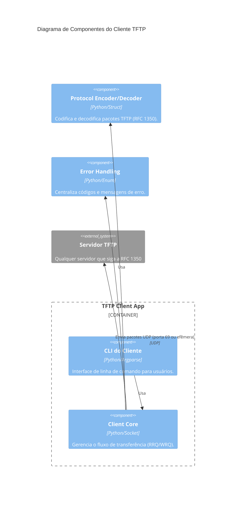

# 📦 TFTP Python CLI – Cliente


Implementação acadêmica do **cliente TFTP** em Python, com interface de linha de comando, seguindo as especificações da RFC 1350. Este projeto faz parte da disciplina **Desenvolvimento de Jogos Multiplayer** e tem como foco o estudo do protocolo TFTP, boas práticas de codificação (PEP 8) e organização do trabalho com pull requests no Git.

## 📝 Descrição da atividade

Esta atividade tem como objetivo estudar o protocolo TFTP, compreender o fluxo de trabalho com pull requests em Git, modelar a arquitetura do sistema por meio de diagramas C4 e implementar, em Python, um **cliente TFTP** com interface CLI.

O projeto foi desenvolvido considerando:
- 📚 estudo do protocolo TFTP a partir da RFC 1350;
- ✨ adoção de boas práticas de codificação com PEP 8;
- 🌿 uso de branches e pull requests para colaboração;
- 🧪 testes com servidores TFTP externos em diferentes sistemas operacionais.

## 👥 Equipe (Client)

| Membro | Matrícula |
|--------|-----------|
| 👤 Juliana Ballin Lima | 2315310011 |
| 👤 João Lucas Noronha de Castro | 2315310009 |
| 👤 Leonardo Castro da Silva | 2215310016 |
| 👤 Leonardo Melo Crispim | 2315310036 |
| 👤 Lucas Carvalho dos Santos | 2315310012 |
| 👤 Renato Barbosa de Carvalho | 2315310021 |
| 👤 Vinicius Souza Costa | 2315310024 |

> **Observação**: O servidor TFTP correspondente está sendo desenvolvido por outra parte da equipe, mas este cliente é capaz de se comunicar com qualquer servidor que siga a RFC 1350.

## 🤖 Uso de IA no Desenvolvimento

Este projeto utilizou IA (ChatGPT e DeepSeek) para auxiliar na revisão de código, sugestões de boas práticas, formatação de commits e documentação do README.

> **Nota**: Todo código gerado ou sugerido por IA foi revisado e testado pela equipe antes de ser integrado ao projeto.

## 📁 Estrutura do Projeto (Cliente)

```bash
📦 tftp-client
├── 📄 client.py                 # Cliente TFTP (GET/PUT)
├── 📄 tftp_packets.py           # Codificação/decodificação de pacotes
├── 📄 requirements.txt          # Dependências do projeto
├── 📄 .flake8                   # Configuração de lint
├── 📄 .gitignore                # Arquivos ignorados pelo Git
├── 📄 LICENSE                   # Licença do projeto
├── 📄 README.md                 # Documentação principal
├── 📁 tests/                    # Testes unitários
│   └── 📄 test_tftp_packets.py
│   └── 📄 test_client.py
└── 📁 docs/                     # Documentação
    └── 📁 diagrams/              # Diagramas C4
        └── 📄 01_contexto.png
        └── 📄 02_containers.png
        └── 📄 03_componentes_cliente.png
        └── 📄 04_codigo.png               
```

## 🧠 Visão geral do protocolo TFTP

O TFTP é um protocolo simples de transferência de arquivos baseado em UDP. Ele foi projetado para cenários leves, como bootstrap de dispositivos, envio de arquivos de configuração e transferência simples em redes locais.

### Características principais:
- 📡 usa UDP;
- 🔌 porta inicial 69 para requisições;
- 📖 suporta leitura (RRQ) e escrita (WRQ);
- 📦 transmite dados em blocos de até 512 bytes;
- ✅ usa ACK para confirmar cada bloco;
- 🏁 encerra a transferência quando o último pacote DATA possui menos de 512 bytes.

## 🧩 Diagrama C4 – Cliente TFTP

O diagrama abaixo mostra os principais componentes do cliente TFTP e sua interação com o usuário, com o servidor remoto e com o módulo de codificação/decodificação de pacotes.




## 🔧 Requisitos

- 🐍 Python 3.10+
- 💻 Sistema operacional Windows, Linux ou macOS
- 🌿 Git

## 📦 Instalação

```bash
# Clone o repositório
git clone https://github.com/seu-usuario/nome-do-repositorio.git
cd nome-do-repositorio

# Crie e ative o ambiente virtual
python -m venv .venv
source .venv/bin/activate  # Linux/Mac

# No Windows PowerShell:
# .venv\Scripts\Activate.ps1

# Instale as dependências
pip install -r requirements.txt
```

## 🚀 Como executar o cliente

### Download (GET) – receber arquivo do servidor
```bash
python client.py get --host 127.0.0.1 --port 6969 --remote arquivo_remoto.txt --local arquivo_local.txt
```

### Upload (PUT) – enviar arquivo para o servidor
```bash
python client.py put --host 127.0.0.1 --port 6969 --local arquivo_local.txt --remote arquivo_remoto.txt
```

## ✅ Testes com servidores externos

Para verificar o funcionamento do cliente, utilize um servidor TFTP externo (como o cliente TFTP do Windows, Linux ou macOS) ou o servidor desenvolvido pelos colegas.

### 1. Inicie um servidor TFTP
- **Windows**: Ative o recurso "Cliente TFTP" em "Recursos do Windows" e utilize o comando `tftp` no modo servidor ou use um servidor de terceiros (ex.: SolarWinds TFTP Server).
- **Linux/macOS**: Instale um servidor como `atftpd` ou `tftpd-hpa`.

### 2. Teste de download (GET)
```bash
# Coloque um arquivo de teste no diretório do servidor
echo "Conteúdo do arquivo" > /srv/tftp/teste.txt

# Execute o cliente para baixar
python client.py get --host 127.0.0.1 --port 69 --remote teste.txt --local baixado.txt
```

### 3. Teste de upload (PUT)
```bash
# Crie um arquivo local
echo "Enviado pelo cliente" > enviar.txt

# Execute o cliente para enviar
python client.py put --host 127.0.0.1 --port 69 --local enviar.txt --remote recebido.txt

# Verifique se o arquivo apareceu no diretório do servidor
cat /srv/tftp/recebido.txt
```

## 🧪 Testes unitários

### Executar testes unitários
```bash
pytest tests/ -v
```

### Verificar cobertura
```bash
pytest --cov=. tests/ --cov-report=term-missing
```

### Verificar estilo de código
```bash
flake8 .
black --check .
```

## 📚 Referências

- [RFC 1350 - The TFTP Protocol (Revision 2)](https://datatracker.ietf.org/doc/html/rfc1350)
- [Git Pull Request - GeeksforGeeks](https://www.geeksforgeeks.org/git/git-pull-request/)
- [Conventional Commits](https://www.conventionalcommits.org/)
- [PEP 8 - Style Guide](https://www.python.org/dev/peps/pep-0008/)

## 📄 Licença

Este projeto está sob a licença MIT. Veja o arquivo [LICENSE](LICENSE) para mais detalhes.

---

<div align="center">
  Desenvolvido para fins acadêmicos - Universidade do Estado do Amazonas (UEA)<br>
  <strong>Juliana Ballin Lima</strong> e equipe
</div>
```
