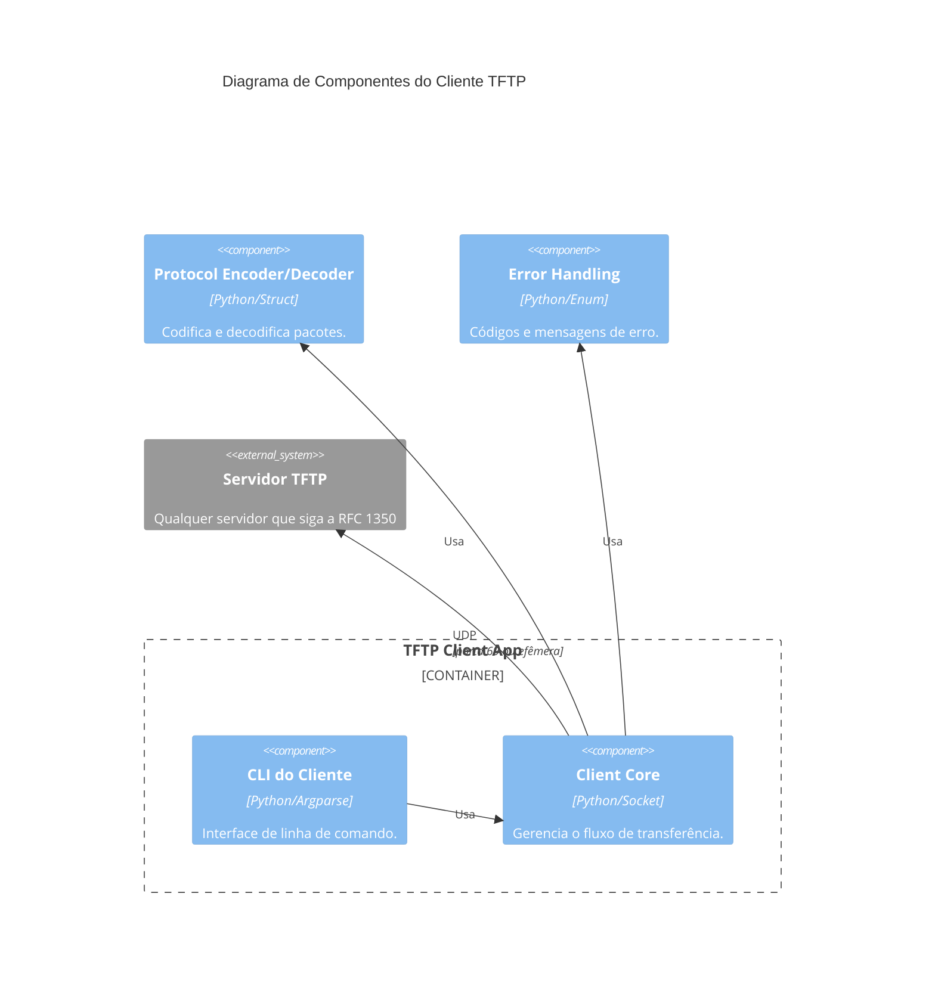

<h1 align="center">📡 TFTP Python CLI - Cliente</h1>

<p align="center">
  
</p>

<p align="center">
  Cliente TFTP em Python, seguindo a RFC 1350, com interface CLI e arquitetura modular.
  Desenvolvido para disciplina de Tópicos Especiais para Computação I.
</p>

<h2 align="center">📝 Descrição do Projeto</h2>

Este projeto implementa um **cliente TFTP** completo, capaz de realizar downloads (GET) e uploads (PUT) de arquivos. O código segue as especificações da RFC 1350, utilizando UDP, blocos de 512 bytes e confirmações (ACK). A arquitetura é separada em módulos: um para a lógica de transferência e outro para a codificação/decodificação dos pacotes.

O projeto inclui:
- Diagrama de componentes C4 no README e em `docs/diagrams`.
- Testes unitários com `unittest`.
- Interface de linha de comando (CLI) via `argparse`.
- Suporte apenas ao modo **octet** (binário), que é o mais comum.

<h2 align="center">🤖 Tecnologias Utilizadas</h2>

<p align="center">
  <a href="https://www.python.org"></a>
  <a href="https://docs.python.org/3/library/unittest.html"></a>
  <a href="https://www.python.org/dev/peps/pep-0008/"></a>
  <a href="https://git-scm.com/"></a>
</p>

<h2 align="center">📁 Estrutura do Projeto</h2>

```bash
📦 tftp-client
├── 📄 client.py # Lógica principal do cliente
├── 📄 tftp_packets.py # Codificação/decodificação de pacotes
├── 📄 logger.py # Logs coloridos
├── 📄 exceptions.py # Exceções personalizadas
├── 📄 cli.py # CLI e menu interativo
├── 📄 main.py # Ponto de entrada (modo automático)
├── 📄 requirements.txt # Dependências
├── 📄 LICENSE # MIT
├── 📄 README.md
├── 📁 tests/ # Testes unitários
└── 📁 docs/diagrams/ # Diagramas C4
```

<h1 align="center">🧩 Diagrama C4 – Cliente TFTP</h1>



<p align="center">
  
</p>

<h1 align="center">🚀 Como Executar</h1>

### Instalação
```bash
git clone https://github.com/JulianaBallin/tftp-client.git
cd tftp-client
python -m venv .venv
source .venv/bin/activate  # Linux/Mac
# .venv\Scripts\activate   # Windows
pip install -r requirements.txt
```

### Download (GET)
```bash
python client.py get --host 127.0.0.1 --port 69 --remote arquivo.txt --local destino.txt
```

### Upload (PUT)
```bash
python client.py put --host 127.0.0.1 --port 69 --local local.txt --remote remoto.txt
```

<h2 align="center">🧪 Testes</h2>

```bash
# Executar testes unitários
python -m unittest discover tests

# Com cobertura (se pytest instalado)
pytest tests/ --cov=. --cov-report=term
```

<h2 align="center">📚 Referências</h2>

- [RFC 1350 – TFTP](https://datatracker.ietf.org/doc/html/rfc1350)
- [Git Pull Request](https://www.geeksforgeeks.org/git/git-pull-request/)
- [PEP 8 – Style Guide](https://www.python.org/dev/peps/pep-0008/)

<h2 align="center">👥 Equipe</h2>

| Nome | Matrícula |
|------|-----------|
| Juliana Ballin Lima | 2315310011 |
| João Lucas Noronha de Castro | 2315310009 |
| Leonardo Castro da Silva | 2215310016 |
| Leonardo Melo Crispim | 2315310036 |
| Lucas Carvalho dos Santos | 2315310012 |
| Renato Barbosa de Carvalho | 2315310021 |
| Vinicius Souza Costa | 2315310024 |

---

<h3 align="center">MIT © Equipe 4 – UEA</h3>
