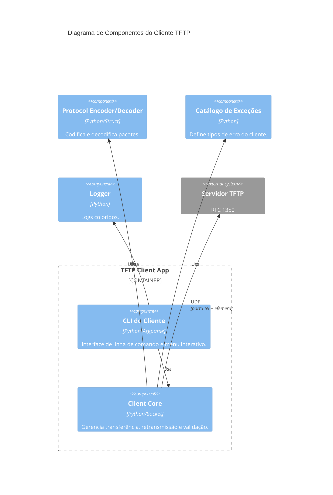

<h1 align="center">📡 TFTP Python CLI - Cliente</h1>

<p align="center">
  
</p>

<p align="center">
  Cliente TFTP em Python, seguindo a RFC 1350, com interface CLI e menu interativo.<br>
  Desenvolvido para disciplina de <strong>Tópicos Especiais para Computação I - Grupo 4</strong>
</p>

---

<h2 align="center">📝 Descrição do Projeto</h2>

Este projeto implementa um **cliente TFTP** completo, capaz de realizar downloads (GET) e uploads (PUT) de arquivos. O código segue as especificações da RFC 1350, utilizando UDP, blocos de 512 bytes e confirmações (ACK). A arquitetura é modular e conta com:

* **Menu interativo** com pastas organizadas (`downloads/` e `uploads/`)
* **Logs coloridos** para melhor visualização
* **Exceções personalizadas** para tratamento de erros
* **Testes unitários** com `unittest`
* **Suporte a qualquer tipo de arquivo** (texto, imagem, PDF, vídeo)
* **Caminho remoto flexível**, permitindo envio para a raiz do servidor ou para subpastas (se existirem)

---

<h2 align="center">🤖 Tecnologias Utilizadas</h2>

<p align="center">
  <a href="https://www.python.org"></a>
  <a href="https://docs.python.org/3/library/unittest.html"></a>
  <a href="https://www.python.org/dev/peps/pep-0008/"></a>
  <a href="https://git-scm.com/"></a>
</p>

---

<h2 align="center">📁 Estrutura do Projeto</h2>

```bash
📦 tftp-client
├── 📄 client.py          # Lógica principal do cliente
├── 📄 tftp_packets.py    # Codificação/decodificação de pacotes
├── 📄 logger.py          # Logs coloridos
├── 📄 exceptions.py      # Exceções personalizadas
├── 📄 cli.py             # CLI e menu interativo
├── 📄 main.py            # Ponto de entrada
├── 📄 requirements.txt   # Dependências
├── 📄 LICENSE            # MIT
├── 📄 README.md
├── 📁 downloads/         # Arquivos baixados (criado automaticamente)
├── 📁 uploads/           # Arquivos para upload (coloque aqui)
├── 📁 tests/             # Testes unitários
└── 📁 docs/diagrams/     # Diagramas C4
```

---

<h2 align="center">🧩 Diagrama C4 – Cliente TFTP</h2>



<p align="center">
  
</p>

---
<h2 align="center">🚀 Como Executar</h2>

<h3 align="center">🖥️ CONFIGURAÇÃO E VALIDAÇÃO DO SERVIDOR</h3>

⚠️ **NÃO pule esta etapa**  
>A maioria dos erros (`File not found`) ocorre por configuração incorreta do servidor.

---

<h3 align="center">🐧 Linux (Ubuntu/Debian)</h3>

### 1. Instalar

```bash
sudo apt update
sudo apt install tftpd-hpa -y
```

---

### 2. Configurar

```bash
sudo nano /etc/default/tftpd-hpa
```

```bash
TFTP_USERNAME="tftp"
TFTP_DIRECTORY="/srv/tftp"
TFTP_ADDRESS=":69"
TFTP_OPTIONS="--secure --create --permissive"
```

---

### 3. Criar diretórios

```bash
sudo mkdir -p /srv/tftp/grupo4
sudo chmod -R 777 /srv/tftp
sudo chown -R tftp:tftp /srv/tftp
```

---

### 4. Reiniciar e verificar

```bash
sudo systemctl restart tftpd-hpa
sudo systemctl status tftpd-hpa
```

✔ Deve aparecer `active (running)`

---

### 5. Validar servidor (ANTES do cliente)

```bash
echo "teste" | sudo tee /srv/tftp/grupo4/remoto.txt
```

```bash
tftp 127.0.0.1
get grupo4/remoto.txt
quit
```

✔ Se falhar → problema no servidor

---

<h3 align="center">🍎 macOS</h3>

```bash
brew install tftp-hpa

sudo mkdir -p /private/tftpboot/grupo4
sudo chmod -R 777 /private/tftpboot

sudo /usr/local/sbin/in.tftpd -l -s /private/tftpboot -p 69
```

Teste:

```bash
tftp localhost
get grupo4/remoto.txt
```

---

<h3 align="center">🪟 Windows</h3>

### Usando TFTPD32

1. Baixar: https://tftpd32.jounin.net/
2. Configurar diretório (ex: `C:\tftp`)
3. Ativar:

   * Allow create
   * Write support

Criar pasta:

```cmd
mkdir C:\tftp\grupo4
```

Teste:

```cmd
tftp 127.0.0.1
get grupo4/remoto.txt
```

---

<h3 align="center">🚀 EXECUÇÃO DO CLIENTE</h3>

### 1. Instalação

```bash
# Clone o repositório
git clone https://github.com/JulianaBallin/tftp-client.git
cd tftp-client

# Crie e ative o ambiente virtual
python -m venv .venv
source .venv/bin/activate  # Linux/Mac
# .venv\Scripts\activate   # Windows

# Instale as dependências
pip install -r requirements.txt
```

---

### 2. Executar menu

```bash
python main.py
```

---

O menu exibirá:

```
==================================================
=== Cliente TFTP - GRUPO 4 ===
==================================================
1. Baixar arquivo (GET) -> salva em 'downloads/'
2. Enviar arquivo   (PUT)  -> lê de 'uploads/'
3. Listar arquivos baixados
4. Listar arquivos para upload
5. Sair
Escolha:
```

<h3 align="center">📥 GET (Download)</h3>

1. Escolha opção `1`
2. Digite o host do servidor (ex: `127.0.0.1`)
3. Digite a porta (padrão `69`)
4. Digite o nome do arquivo remoto (ex: `foto.jpg`)
5. Escolha se deseja usar uma pasta no servidor (ex: `grupo4`)
6. O arquivo será salvo em `downloads/`

---

<h3 align="center">📤 PUT (Upload)</h3>

1. Coloque os arquivos que deseja enviar na pasta `uploads/`
2. Escolha opção `2`
3. Digite o host do servidor
4. Digite a porta
5. Digite o nome que o arquivo terá no servidor
6. Escolha se deseja usar uma pasta no servidor (ex: `grupo4`)
7. Escolha o número do arquivo na lista exibida
8. O arquivo será enviado exatamente para o caminho informado

💡 Exemplos:
- Sem pasta: `arquivo.txt`
- Com pasta: `grupo4/arquivo.txt` (se a pasta existir no servidor)

> 💡 Dica:
> - Se não tiver certeza, use apenas o nome do arquivo (ex: `teste.txt`)
> - Use pastas apenas se souber que elas existem no servidor
---

### 💻 Linha de comando

```bash
python main.py get --host 127.0.0.1 --remote arquivo.txt --local downloads/x.txt
```

```bash
# Upload sem pasta
python main.py put --host 127.0.0.1 --local uploads/x.txt --remote arquivo.txt

# Upload com pasta (se existir no servidor)
python main.py put --host 127.0.0.1 --local uploads/x.txt --remote grupo4/arquivo.txt
```


<h3 align="center">📊 Funcionalidades do Menu</h3>

| Opção | Função | O que faz |
|-------|--------|----------|
| 1 | GET | Baixa arquivo do servidor usando o caminho informado e salva em `downloads/` |
| 2 | PUT | Lista arquivos de `uploads/`, escolhe por número e envia para o caminho informado |
| 3 | Listar downloads | Mostra arquivos já baixados na pasta `downloads/` |
| 4 | Listar uploads | Mostra arquivos disponíveis na pasta `uploads/` |
| 5 | Sair | Encerra o programa |

---

<h2 align="center">🧪 TESTES</h2>

```bash
python -m unittest discover tests -v
```

---

<h2 align="center">🐛 Tratamento de Erros</h2>

### ❌ File not found

✔ pasta informada não existe no servidor
✔ diretório errado
✔ servidor não reiniciado

---

### ❌ Upload falha

✔ permissões incorretas

```bash
sudo chmod -R 777 /srv/tftp
sudo chown -R tftp:tftp /srv/tftp
```

---

### ❌ Funciona no tftp mas não no cliente

✔ erro de caminho
✔ duplicação de `grupo4/`

---

<h2 align="center">📚 Referências</h2>

- [RFC 1350 – TFTP](https://datatracker.ietf.org/doc/html/rfc1350)
- [Git Pull Request](https://www.geeksforgeeks.org/git/git-pull-request/)
- [PEP 8 – Style Guide](https://www.python.org/dev/peps/pep-0008/)

---

<h2 align="center">👥 Equipe</h2>

| Nome | Matrícula |
|------|-----------|
| Juliana Ballin Lima | 2315310011 |

---

<h3 align="center">MIT © Equipe 4 – UEA</h3>

