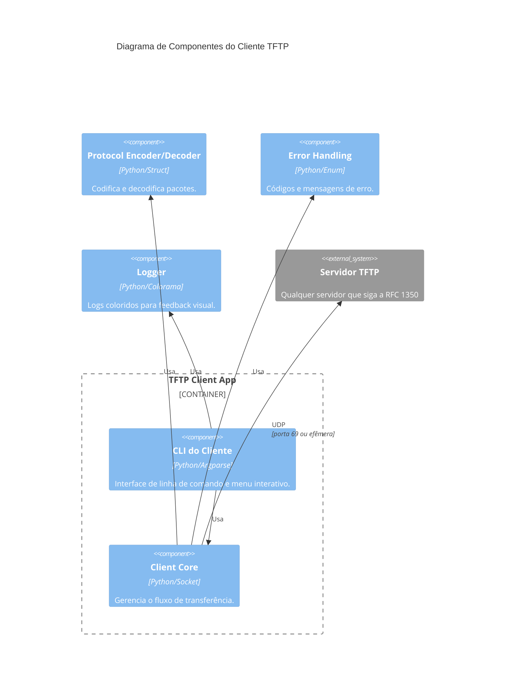
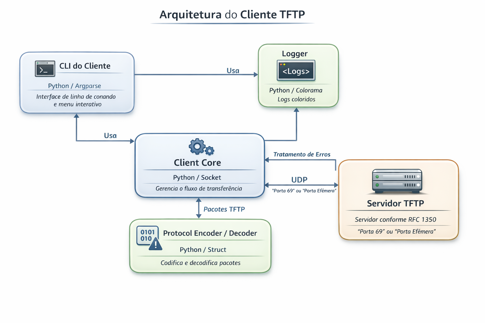

<h1 align="center">📡 TFTP Python CLI - Cliente</h1>

<p align="center">
  
</p>

<p align="center">
  Cliente TFTP em Python, seguindo a RFC 1350, com interface CLI e menu interativo.<br>
  Desenvolvido para disciplina de <strong>Tópicos Especiais para Computação I - Grupo 4</strong>
</p>

---

<h2 align="center">📝 Descrição do Projeto</h2>

Este projeto implementa um **cliente TFTP** completo, capaz de realizar downloads (GET) e uploads (PUT) de arquivos. O código segue as especificações da RFC 1350, utilizando UDP, blocos de 512 bytes e confirmações (ACK). A arquitetura é modular e conta com:

- **Menu interativo** com pastas organizadas (`downloads/` e `uploads/`)
- **Logs coloridos** para melhor visualização
- **Exceções personalizadas** para tratamento de erros
- **Testes unitários** com `unittest`
- **Suporte a qualquer tipo de arquivo** (texto, imagem, PDF, vídeo)
- **Organização automática** no servidor dentro da pasta `grupo4/`

---

<h2 align="center">🤖 Tecnologias Utilizadas</h2>

<p align="center">
  <a href="https://www.python.org"></a>
  <a href="https://docs.python.org/3/library/unittest.html"></a>
  <a href="https://www.python.org/dev/peps/pep-0008/"></a>
  <a href="https://git-scm.com/"></a>
</p>

---

<h2 align="center">📁 Estrutura do Projeto</h2>

```bash
📦 tftp-client
├── 📄 client.py          # Lógica principal do cliente
├── 📄 tftp_packets.py    # Codificação/decodificação de pacotes
├── 📄 logger.py          # Logs coloridos
├── 📄 exceptions.py      # Exceções personalizadas
├── 📄 cli.py             # CLI e menu interativo
├── 📄 main.py            # Ponto de entrada
├── 📄 requirements.txt   # Dependências
├── 📄 LICENSE            # MIT
├── 📄 README.md
├── 📁 downloads/         # Arquivos baixados (criado automaticamente)
├── 📁 uploads/           # Arquivos para upload (coloque aqui)
├── 📁 tests/             # Testes unitários
└── 📁 docs/diagrams/     # Diagramas C4
```

---

<h2 align="center">🧩 Diagrama C4 – Cliente TFTP</h2>



<p align="center">
  
</p>

---

<h2 align="center">🚀 Como Executar</h2>

### 1. Instalação

```bash
# Clone o repositório
git clone https://github.com/JulianaBallin/tftp-client.git
cd tftp-client

# Crie e ative o ambiente virtual
python -m venv .venv
source .venv/bin/activate  # Linux/Mac
# .venv\Scripts\activate   # Windows

# Instale as dependências
pip install -r requirements.txt
```

### 2. Menu Interativo (recomendado)

Execute sem argumentos para abrir o menu:

```bash
python main.py
```

O menu exibirá:

```
==================================================
=== Cliente TFTP - GRUPO 4 ===
==================================================
1. Baixar arquivo (GET) -> salva em 'downloads/'
2. Enviar arquivo   (PUT)  -> lê de 'uploads/'
3. Listar arquivos baixados
4. Listar arquivos para upload
5. Sair
Escolha:
```

**Para baixar um arquivo (GET):**
1. Escolha opção `1`
2. Digite o host do servidor (ex: `127.0.0.1`)
3. Digite a porta (padrão `69`)
4. Digite o nome do arquivo remoto (ex: `foto.jpg`)
5. O arquivo será salvo em `downloads/foto.jpg`

**Para enviar um arquivo (PUT):**
1. Coloque os arquivos que deseja enviar na pasta `uploads/`
2. Escolha opção `2`
3. Digite o host do servidor
4. Digite a porta
5. Digite o nome que o arquivo terá no servidor
6. Escolha o número do arquivo na lista exibida
7. O arquivo será enviado para `/srv/tftp/grupo4/nome_escolhido`

### 3. Linha de Comando (modo direto)

```bash
# Download (GET)
python main.py get --host 127.0.0.1 --remote arquivo.txt --local downloads/meu_arquivo.txt

# Upload (PUT)
python main.py put --host 127.0.0.1 --local uploads/meu_arquivo.txt --remote grupo4/destino.txt
```

---

<h2 align="center">🖥️ Configurando um Servidor TFTP para Testes</h2>

<h3 align="center">🐧 Linux (Ubuntu/Debian)</h3>

```bash
# Instalar servidor
sudo apt update
sudo apt install tftpd-hpa -y

# Criar diretório base
sudo mkdir -p /srv/tftp
sudo chmod 777 /srv/tftp

# Configurar para aceitar uploads e criação de pastas
sudo nano /etc/default/tftpd-hpa
```

Altere a linha `TFTP_OPTIONS` para:

```
TFTP_OPTIONS="--secure --create --permissive"
```

Reinicie o serviço:

```bash
sudo systemctl restart tftpd-hpa
```

<h3 align="center">🍎 macOS</h3>

```bash
# Instalar via Homebrew
brew install tftp-hpa

# Criar diretório base
sudo mkdir -p /private/tftpboot
sudo chmod 777 /private/tftpboot

# Iniciar servidor (em foreground para teste)
sudo /usr/local/sbin/in.tftpd -l -s /private/tftpboot -p 69

# Para rodar em background, use launchctl ou mantenha em outro terminal
```

Para parar o servidor: `Ctrl+C` no terminal onde está rodando.

<h3 align="center">🪟 Windows</h3>

**Opção 1: Ativar serviço TFTP nativo**

1. Abra o **Painel de Controle** → **Programas e Recursos** → **Ativar ou desativar recursos do Windows**
2. Marque **Cliente TFTP** e **Servidor TFTP**
3. Clique em OK e aguarde a instalação

**Opção 2: Usar servidor de terceiros (recomendado)**

Baixe e instale o **TFTPD32** ou **SolarWinds TFTP Server**:

1. Acesse: https://tftpd32.jounin.net/
2. Baixe o TFTPD32 (versão portable ou instalador)
3. Execute o programa
4. Configure o diretório base (ex: `C:\tftp`)
5. Marque a opção "Allow create" para permitir uploads
6. Clique em "Start"

Crie a pasta do grupo manualmente:

```cmd
mkdir C:\tftp\grupo4
```

---

<h2 align="center">📂 Criar Pasta do Grupo no Servidor</h2>

Se o servidor não tiver a opção `--create` ativada, o administrador deve criar manualmente:

<h3 align="center">🐧 Linux / 🍎 macOS</h3>

```bash
sudo mkdir -p /srv/tftp/grupo4
sudo chmod 777 /srv/tftp/grupo4
```

<h3 align="center">🪟 Windows</h3>

```cmd
mkdir C:\tftp\grupo4
```

---

<h2 align="center">🧪 Testes</h2>

### Testes Unitários

```bash
# Executar todos os testes
python -m unittest discover tests -v

# Resultado esperado: 16 testes OK
```

### Teste com Servidor Local

**1. Criar arquivo de teste no servidor:**

```bash
# Linux/macOS
echo "Conteúdo de teste" | sudo tee /srv/tftp/grupo4/remoto.txt

# Windows (PowerShell como Admin)
"Conteúdo de teste" | Out-File -FilePath C:\tftp\grupo4\remoto.txt
```

**2. Baixar com o cliente:**

```bash
python main.py
# Opção 1 -> host: 127.0.0.1 -> remoto: remoto.txt
```

**3. Enviar arquivo:**

```bash
echo "Upload teste" > uploads/local.txt
python main.py
# Opção 2 -> host: 127.0.0.1 -> remoto: enviado.txt -> escolha o arquivo
```

**4. Verificar no servidor:**

```bash
# Linux/macOS
cat /srv/tftp/grupo4/enviado.txt

# Windows (PowerShell)
Get-Content C:\tftp\grupo4\enviado.txt
```

---

<h2 align="center">📊 Funcionalidades do Menu</h2>

| Opção | Função | O que faz |
|-------|--------|----------|
| 1 | GET | Baixa arquivo do servidor (busca em `grupo4/`) e salva em `downloads/` |
| 2 | PUT | Lista arquivos de `uploads/`, escolhe por número, envia para `grupo4/` no servidor |
| 3 | Listar downloads | Mostra arquivos já baixados na pasta `downloads/` |
| 4 | Listar uploads | Mostra arquivos disponíveis na pasta `uploads/` |
| 5 | Sair | Encerra o programa |

### Recursos Especiais

- **Verificação de tamanho:** Avisa se o arquivo exceder ~32 MB
- **Sugestão de extensão:** Se o nome remoto não tiver extensão, sugere adicionar
- **Criação automática de pasta:** Tenta criar `grupo4` no servidor se não existir
- **Logs coloridos:** Info (ciano), Sucesso (verde), Aviso (amarelo), Erro (vermelho)

---

<h2 align="center">🐛 Tratamento de Erros</h2>

| Situação | Mensagem exibida |
|----------|------------------|
| Arquivo remoto não existe | `Erro do servidor (código 1): File not found` |
| Pasta grupo4 não existe | Exibe comando para admin criar: `sudo mkdir -p /srv/tftp/grupo4` |
| Timeout no servidor | `Timeout (tentativa X/Y) → Sem resposta do servidor` |
| Arquivo local não encontrado | `Arquivo local não encontrado: nome.txt` |
| Arquivo muito grande (>32MB) | Aviso e confirmação antes de enviar |

---

<h2 align="center">📚 Referências</h2>

- [RFC 1350 – TFTP](https://datatracker.ietf.org/doc/html/rfc1350)
- [Git Pull Request](https://www.geeksforgeeks.org/git/git-pull-request/)
- [PEP 8 – Style Guide](https://www.python.org/dev/peps/pep-0008/)

---

<h2 align="center">👥 Equipe</h2>

| Nome | Matrícula |
|------|-----------|
| Juliana Ballin Lima | 2315310011 |
| João Lucas Noronha de Castro | 2315310009 |
| Leonardo Castro da Silva | 2215310016 |
| Leonardo Melo Crispim | 2315310036 |
| Lucas Carvalho dos Santos | 2315310012 |
| Renato Barbosa de Carvalho | 2315310021 |
| Vinicius Souza Costa | 2315310024 |

---

<h3 align="center">MIT © Equipe 4 – UEA</h3>

